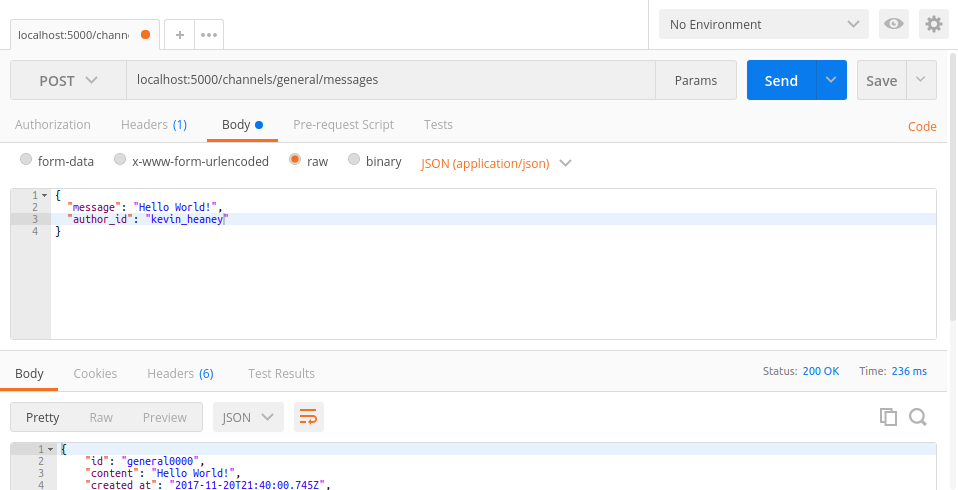

# TagChatter-backend
Este projeto foi desenvolvido utilizando node.js versão 9.2.0 e o módulo [express](https://www.npmjs.com/package/express) versão 4.16.2.

## Iniciar o servidor
Execute `node api.js` para iniciar o servidor. Quando o servidor for iniciado será exibida a mensagem `Server is running on port 5000...`.

## Testando o servidor
Para testar o servidor recomendo o aplicativo [Postman](https://chrome.google.com/webstore/detail/postman/fhbjgbiflinjbdggehcddcbncdddomop?hl=pt-BR)

### GET
Para testar requests tipo GET basta inserir `localhost:5000/` seguido dos parâmetros:
- `/users`,
- `/channels`, ou
- `/channels/:channelId/messages`.

***Exemplo:*** `localhost:5000/channels/general/messages`

### POST
Para testar o request para envio de mensagens(`POST /channels/:channelId/messages`) é necessário inserir o objeto JSON requerido em body, de acordo do com o exemplo abaixo:

